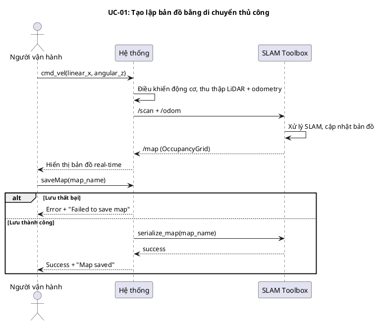
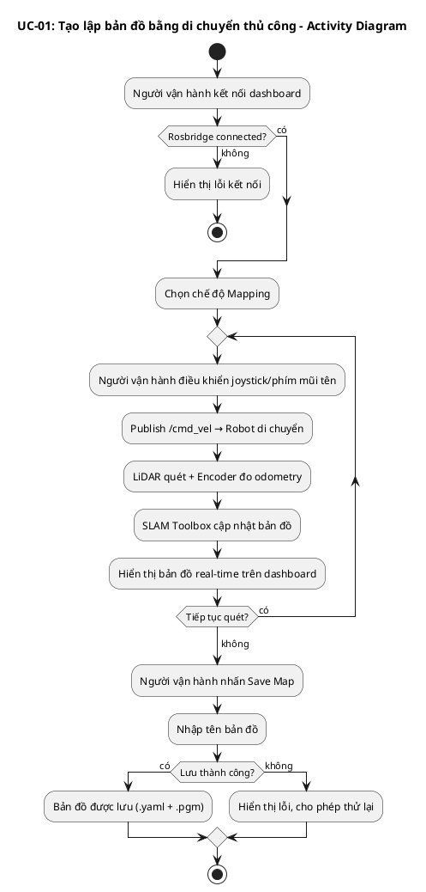
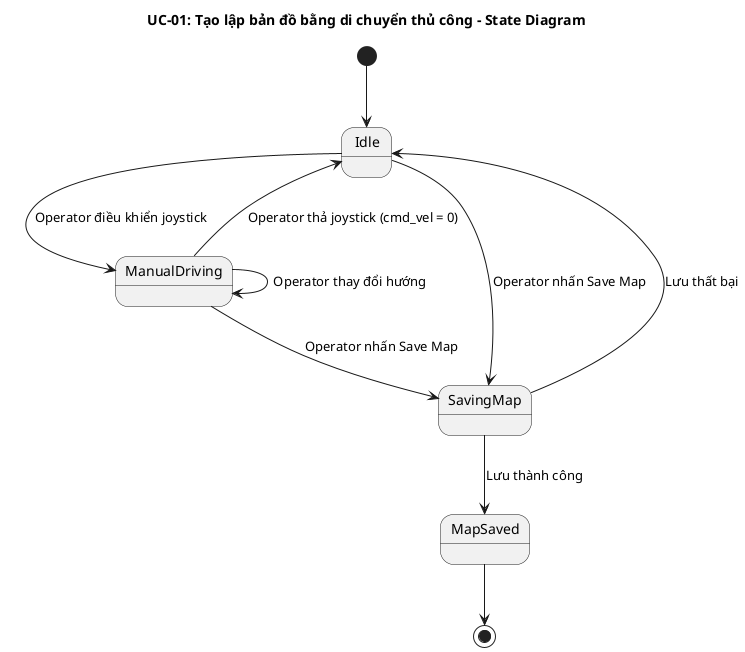
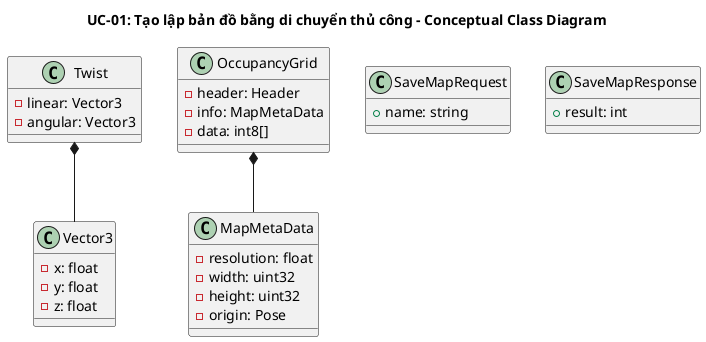
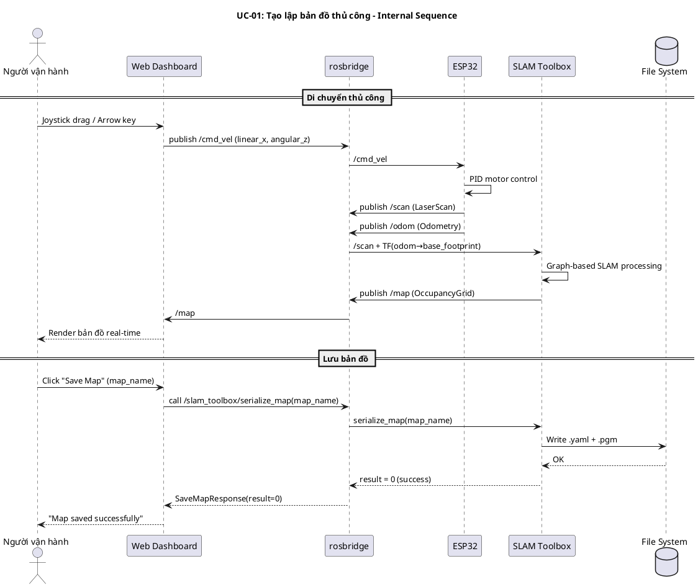
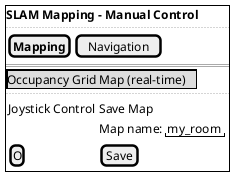

## UC-01: Tạo lập bản đồ bằng di chuyển thủ công

### Mô tả use case

| Mục                            | Nội dung                                                                                                                                                                                                  |
| ------------------------------ | --------------------------------------------------------------------------------------------------------------------------------------------------------------------------------------------------------- |
| Phụ thuộc                      | Không                                                                                                                                                                                                     |
| Mục đích                       | Người vận hành cần khảo sát một không gian mới mà robot chưa có bản đồ. PM cho phép người vận hành điều khiển robot di chuyển thủ công qua joystick/bàn phím, đồng thời xây dựng bản đồ 2D theo thời gian thực nhờ SLAM. |
| Mô tả                          | Người vận hành điều khiển robot di chuyển trong không gian bằng joystick ảo hoặc phím mũi tên, hệ thống sử dụng LiDAR + odometry để xây dựng bản đồ occupancy grid theo thời gian thực, sau đó lưu bản đồ khi hoàn tất. |
| Actor chính                    | Người vận hành (Operator)                                                                                                                                                                                 |
| Actor liên quan                | SLAM Toolbox (xử lý thuật toán SLAM), ESP32 firmware (điều khiển động cơ, đọc encoder, quét LiDAR)                                                                                                       |
| Tiền điều kiện                 | 1. Robot đã bật nguồn và kết nối WiFi   2. Web dashboard đã kết nối rosbridge (status = connected)   3. Hệ thống đang ở chế độ SLAM Mapping                                                        |
| Dãy lệnh thực hiện bình thường | 1. Người vận hành mở web dashboard và xác nhận kết nối ROS thành công   2. Người vận hành chọn chế độ "Mapping" trên Mode Controller   3. Người vận hành sử dụng joystick ảo hoặc phím mũi tên để điều khiển robot di chuyển   4. Hệ thống publish /cmd_vel → ESP32 điều khiển động cơ   5. ESP32 publish /scan (LiDAR) + /odom (encoder) → SLAM Toolbox xây dựng bản đồ   6. Bản đồ occupancy grid được hiển thị real-time trên dashboard qua topic /map   7. Người vận hành di chuyển robot khắp không gian cần quét   8. Người vận hành nhấn "Save Map" và nhập tên bản đồ   9. Hệ thống gọi service /slam_toolbox/serialize_map để lưu bản đồ |
| Hậu điều kiện (thành công)     | Bản đồ 2D (file .yaml + .pgm) được lưu trong thư mục maps, sẵn sàng sử dụng cho chế độ Navigation                                                                                                       |
| Hậu điều kiện (thất bại)       | Bản đồ không được lưu, dữ liệu SLAM trong bộ nhớ vẫn còn (có thể thử lưu lại). Robot dừng di chuyển an toàn.                                                                                             |
| Xử lý ngoại lệ                 | Mất kết nối rosbridge → Dashboard hiển thị lỗi, robot dừng (safety timeout)   Robot va chạm vật cản → Người vận hành dừng joystick, lùi lại   Lưu bản đồ thất bại → Hiển thị thông báo lỗi, cho phép thử lại |

### Lược đồ tuần tự

### Lược đồ hoạt động

### Lược đồ trạng thái

### Lược đồ lớp ý niệm

### Phân rã thành phần PM

#### Controller: `DashboardWebApp`

- **Nhiệm vụ**: Nhận input từ người vận hành (joystick/keyboard), publish lệnh
  điều khiển qua rosbridge WebSocket.
- **Topic publish**: `/cmd_vel` (geometry_msgs/Twist)
- **Service call**: `/slam_toolbox/serialize_map` (slam_toolbox_msgs/SerializePoseGraph)
- **Input**: Joystick drag event hoặc Arrow key event → `Twist { linear.x, angular.z }`
- **Output thành công**: Robot di chuyển, bản đồ hiển thị real-time
- **Output lỗi**: Toast notification lỗi kết nối hoặc lỗi lưu bản đồ

#### UseCase: `ManualMappingUseCase`

- **Nhiệm vụ**: Orchestrate luồng điều khiển thủ công + SLAM mapping.
- **Input**: `Twist` — `{ linear.x: float, angular.z: float }`
- **Output**: `OccupancyGrid` (bản đồ real-time)
- **Gọi đến**:
    - `rosbridge.publish(/cmd_vel)` — gửi lệnh vận tốc đến robot
    - `rosbridge.subscribe(/map)` — nhận bản đồ cập nhật
    - `rosbridge.callService(/slam_toolbox/serialize_map)` — lưu bản đồ

#### Firmware: `ESP32 Main`

- **Nhiệm vụ**: Nhận /cmd_vel, điều khiển động cơ qua TB6612FNG, đọc encoder
  và LiDAR, publish /odom + /scan.
- **Subscribe**: `/cmd_vel` (geometry_msgs/Twist)
- **Publish**:
    - `/scan` (sensor_msgs/LaserScan) — dữ liệu LiDAR 360°
    - `/odom` (nav_msgs/Odometry) — odometry từ wheel encoder
    - `/imu/data_raw` (sensor_msgs/Imu) — dữ liệu IMU

#### Port: `SLAM Toolbox`

- **Nhiệm vụ**: Xử lý thuật toán SLAM, xây dựng bản đồ từ /scan + /odom.
- **Subscribe**: `/scan`, TF (odom → base_footprint)
- **Publish**: `/map` (nav_msgs/OccupancyGrid)
- **Service**: `/slam_toolbox/serialize_map` — lưu bản đồ ra file

#### Lược đồ tuần tự nội bộ PM

#### Giao diện

##### Giao diện mẫu

##### Giao diện ứng dụng

Chưa hiện thực. Sẽ bổ sung ảnh chụp màn hình khi hoàn thành.

### Bảng tham chiếu dò vết

| Use Case | Component         | Topic/Service                    | Node/Store          | Phương thức                | Ghi chú                    |
| -------- | ----------------- | -------------------------------- | ------------------- | -------------------------- | -------------------------- |
| UC-01    | ManualJoystick    | PUB `/cmd_vel`                   | usePublisher        | publishCmdVel()            | Joystick + keyboard        |
| UC-01    | UnifiedMap        | SUB `/map`                       | useTopic            | handleMap()                | Render occupancy grid      |
| UC-01    | SaveMapButton     | SRV `/slam_toolbox/serialize_map`| useMapStore         | saveMap()                  | Lưu bản đồ                |
| UC-01    | ESP32 Firmware    | SUB `/cmd_vel`, PUB `/scan`      | ros_bridge          | cmd_vel_callback()         | Motor + LiDAR              |
| UC-01    | SLAM Toolbox      | SUB `/scan`, PUB `/map`          | async_slam_toolbox  | —                          | Graph-based SLAM           |

### Tiêu chí kiểm thử

| Tiêu chí             | Phép thử                                                                                    | Kết quả mong đợi                                                  | Ghi chú                                |
| -------------------- | ------------------------------------------------------------------------------------------- | ----------------------------------------------------------------- | -------------------------------------- |
| Toàn diện (coverage) | Đối chiếu Activity Diagram ↔ Sequence Diagram: mọi luồng đều được thể hiện                  | Không bỏ sót luồng chính lẫn ngoại lệ                             | Rà soát chéo giữa mục 2 và mục 3       |
| Nhất quán            | Rà soát tên topic, service, component giữa các lược đồ trong cùng UC                        | Không mâu thuẫn giữa các mục 2–6                                  | Đặc biệt kiểm tra tên trong mục 5–6    |
| Truy vết             | Đối chiếu bảng tham chiếu (mục 7) với lược đồ tuần tự nội bộ (mục 6.5)                      | Mọi tương tác trong sequence đều có entry                         | Kiểm tra không thiếu topic/service     |
| Điều khiển           | Kéo joystick → robot di chuyển đúng hướng, thả joystick → robot dừng                        | linear_x và angular_z tương ứng với hướng kéo, cmd_vel = 0 khi thả | Kiểm tra cả joystick và keyboard       |
| Bản đồ real-time     | Di chuyển robot trong phòng → bản đồ hiển thị tường và vật cản                              | Bản đồ occupancy grid cập nhật liên tục, phản ánh đúng môi trường  | Kiểm tra độ trễ < 2s                   |
| Lưu bản đồ           | Nhấn Save Map với tên hợp lệ → file .yaml + .pgm xuất hiện trong thư mục maps               | File tồn tại, có thể load lại trong chế độ Navigation              | Kiểm tra cả trường hợp tên trùng       |
| An toàn              | Mất kết nối WiFi → robot dừng sau safety timeout                                            | Robot dừng trong vòng 500ms sau khi mất kết nối                    | Safety timeout trong firmware           |
