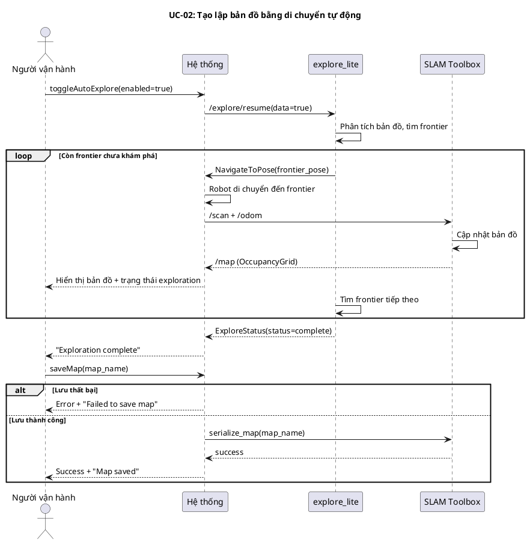
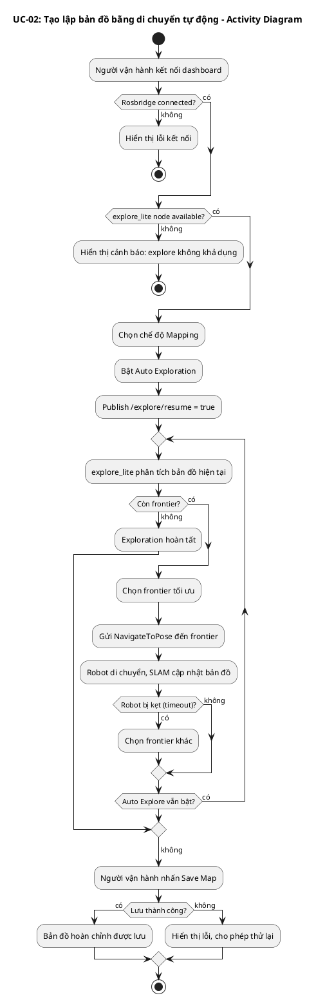
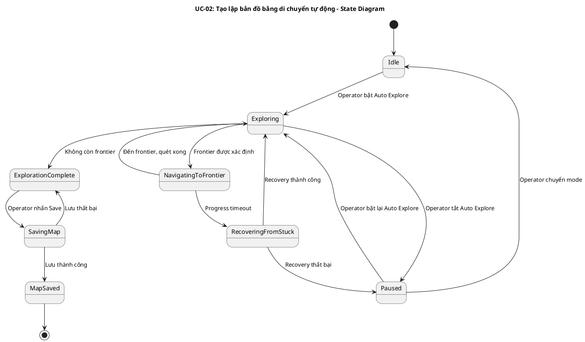
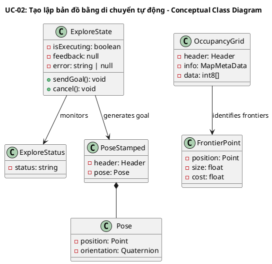
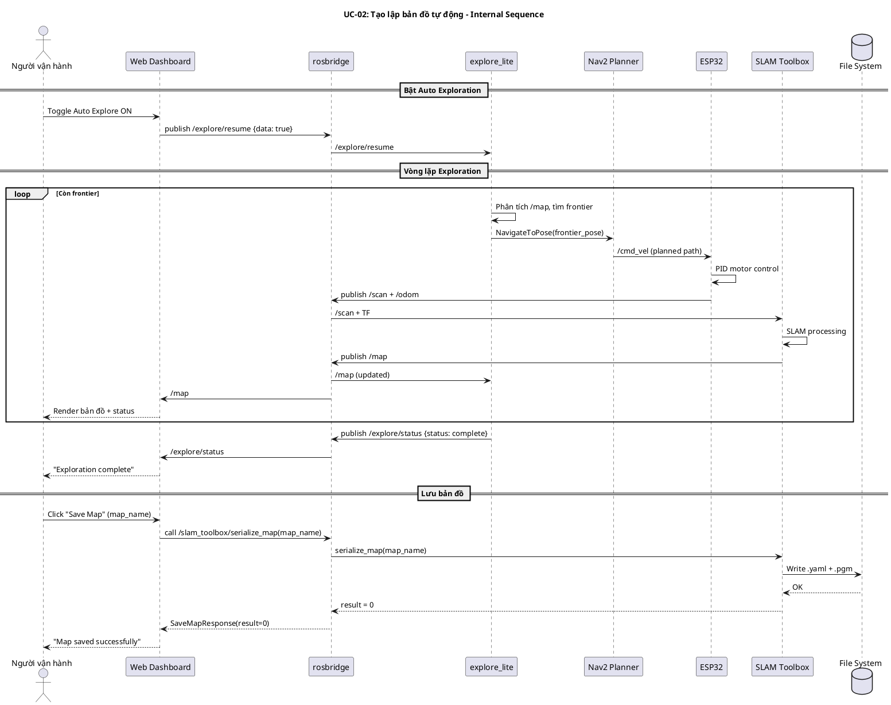
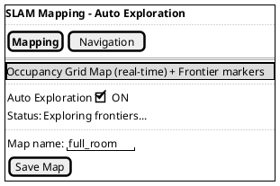

## UC-02: Tạo lập bản đồ bằng di chuyển tự động

### Mô tả use case

| Mục                            | Nội dung                                                                                                                                                                                                                     |
| ------------------------------ | ---------------------------------------------------------------------------------------------------------------------------------------------------------------------------------------------------------------------------- |
| Phụ thuộc                      | UC-01 (chia sẻ cơ sở hạ tầng SLAM Mapping)                                                                                                                                                                                   |
| Mục đích                       | Người vận hành cần quét bản đồ toàn bộ không gian mà không phải điều khiển thủ công. PM cho phép robot tự động khám phá các vùng chưa biết (frontier exploration) để xây dựng bản đồ hoàn chỉnh mà không cần can thiệp liên tục. |
| Mô tả                          | Người vận hành bật chế độ Auto Exploration, hệ thống sử dụng thuật toán frontier exploration (m-explore) để tự động điều hướng robot đến các biên giới chưa khám phá, kết hợp SLAM Toolbox xây dựng bản đồ cho đến khi toàn bộ không gian được quét. |
| Actor chính                    | Người vận hành (Operator)                                                                                                                                                                                                    |
| Actor liên quan                | SLAM Toolbox (xử lý SLAM), explore_lite (frontier exploration), Nav2 planner (lập đường đi), ESP32 firmware (điều khiển robot)                                                                                                |
| Tiền điều kiện                 | 1. Robot đã bật nguồn và kết nối WiFi   2. Web dashboard đã kết nối rosbridge (status = connected)   3. Hệ thống đang ở chế độ SLAM Mapping   4. explore_lite node đã được launch (use_explore = true)                |
| Dãy lệnh thực hiện bình thường | 1. Người vận hành mở web dashboard và xác nhận kết nối ROS thành công   2. Người vận hành chọn chế độ "Mapping" trên Mode Controller   3. Người vận hành bật toggle "Auto Exploration"   4. Hệ thống publish /explore/resume = true → explore_lite bắt đầu tìm frontier   5. explore_lite xác định frontier gần nhất và gửi navigation goal   6. Robot tự động di chuyển đến frontier, SLAM Toolbox cập nhật bản đồ   7. Quá trình lặp lại cho đến khi không còn frontier (exploration complete)   8. Người vận hành nhấn "Save Map" để lưu bản đồ hoàn chỉnh |
| Hậu điều kiện (thành công)     | Bản đồ 2D hoàn chỉnh (.yaml + .pgm) được lưu, phủ toàn bộ không gian có thể tiếp cận                                                                                                                                        |
| Hậu điều kiện (thất bại)       | Robot dừng tại vị trí hiện tại, bản đồ một phần vẫn còn trong bộ nhớ SLAM (có thể lưu phần đã quét hoặc chuyển sang điều khiển thủ công)                                                                                      |
| Xử lý ngoại lệ                 | Robot bị kẹt (progress_timeout) → explore_lite thử frontier khác   Không còn frontier nhưng bản đồ chưa đầy đủ → Người vận hành điều khiển thủ công bổ sung   Mất kết nối → Robot dừng (safety timeout), exploration tạm dừng |

### Lược đồ tuần tự

### Lược đồ hoạt động

### Lược đồ trạng thái

### Lược đồ lớp ý niệm

### Phân rã thành phần PM

#### Controller: `DashboardWebApp`

- **Nhiệm vụ**: Nhận lệnh bật/tắt Auto Exploration từ người vận hành, publish
  tín hiệu resume/pause qua rosbridge.
- **Topic publish**: `/explore/resume` (std_msgs/Bool)
- **Topic subscribe**: `/explore/status` (explore_lite_msgs/ExploreStatus)
- **Input**: Toggle switch event → `Bool { data: true/false }`
- **Output thành công**: Hiển thị trạng thái exploration (exploring/paused/complete)
- **Output lỗi**: Toast notification lỗi kết nối

#### UseCase: `AutoExplorationUseCase`

- **Nhiệm vụ**: Orchestrate luồng frontier exploration tự động.
- **Input**: `Bool` — `{ data: true }` (bật exploration)
- **Output**: `ExploreStatus` (trạng thái exploration real-time)
- **Gọi đến**:
    - `rosbridge.publish(/explore/resume)` — bật/tắt exploration
    - `rosbridge.subscribe(/explore/status)` — theo dõi trạng thái
    - `rosbridge.subscribe(/map)` — nhận bản đồ cập nhật

#### Node: `explore_lite`

- **Nhiệm vụ**: Thuật toán frontier exploration — phân tích bản đồ, xác định
  biên giới chưa khám phá, gửi navigation goal.
- **Subscribe**: `/map` (costmap), `/explore/resume` (điều khiển)
- **Publish**: `/explore/status` (ExploreStatus)
- **Action client**: `NavigateToPose` — gửi goal đến Nav2 hoặc move_base
- **Parameters**:
    - `planner_frequency`: 0.33 Hz
    - `progress_timeout`: 45.0s
    - `min_frontier_size`: 0.35m

#### Port: `SLAM Toolbox`

- **Nhiệm vụ**: Xử lý thuật toán SLAM, xây dựng bản đồ từ /scan + /odom.
- **Subscribe**: `/scan`, TF (odom → base_footprint)
- **Publish**: `/map` (nav_msgs/OccupancyGrid)
- **Service**: `/slam_toolbox/serialize_map` — lưu bản đồ ra file

#### Lược đồ tuần tự nội bộ PM

#### Giao diện

##### Giao diện mẫu

##### Giao diện ứng dụng

Chưa hiện thực. Sẽ bổ sung ảnh chụp màn hình khi hoàn thành.
