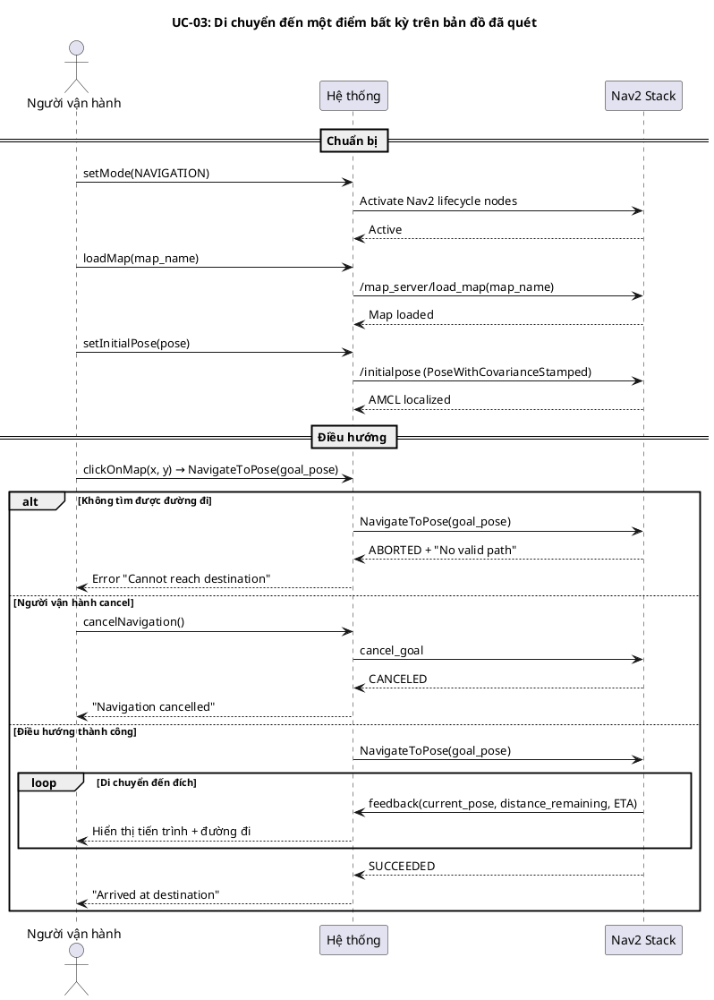
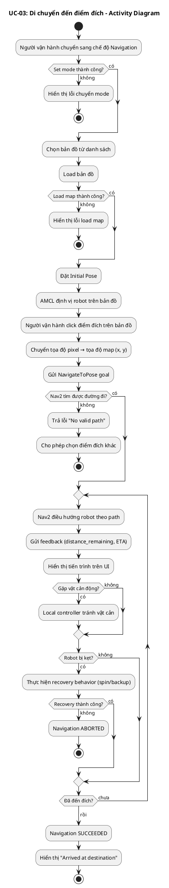
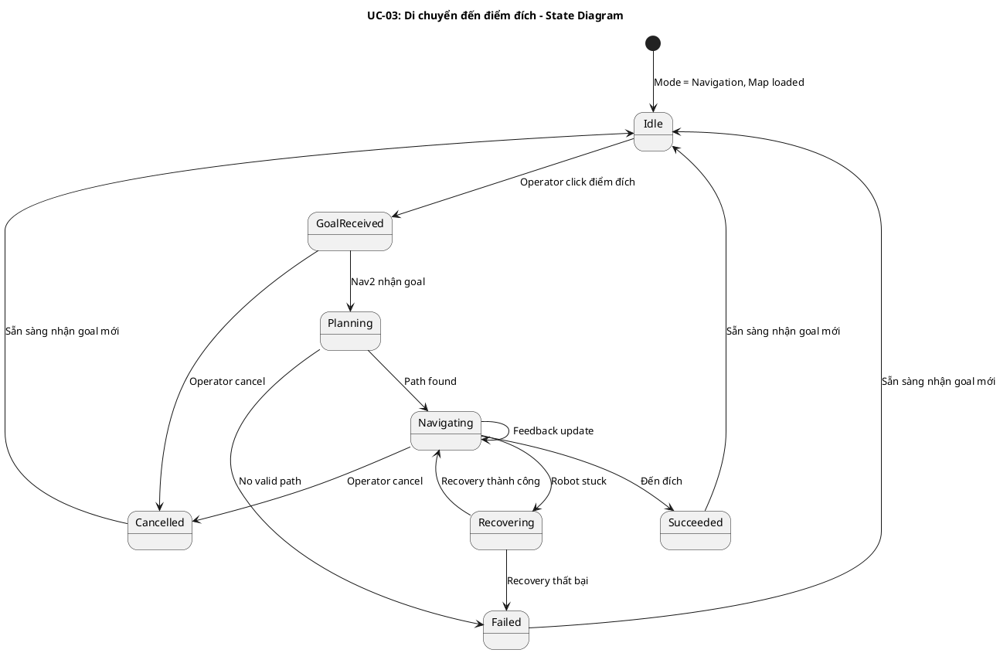
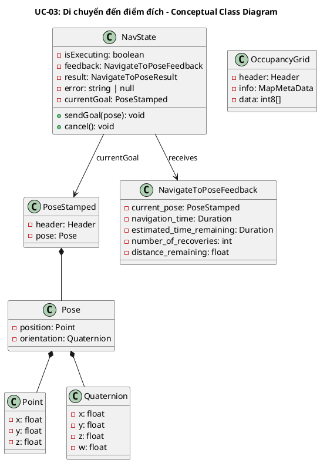
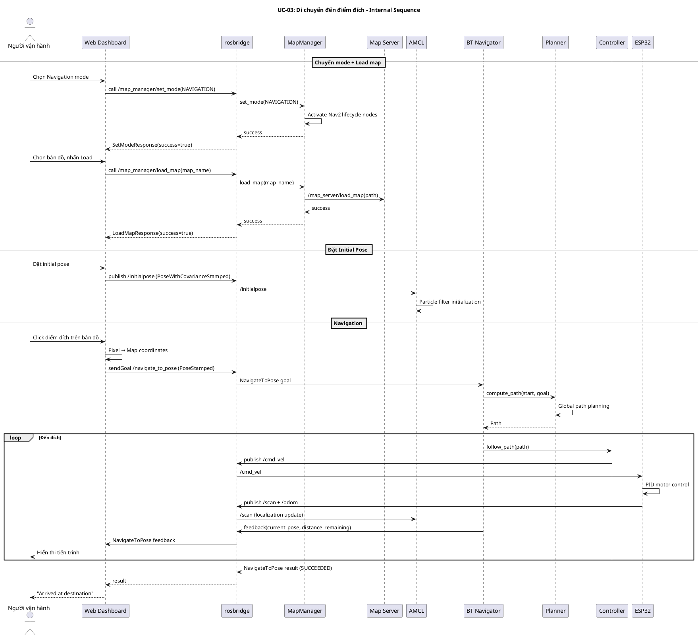
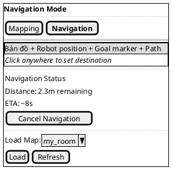

## UC-03: Di chuyển đến một điểm bất kỳ trên bản đồ đã quét

### Mô tả use case

| Mục                            | Nội dung                                                                                                                                                                                                              |
| ------------------------------ | --------------------------------------------------------------------------------------------------------------------------------------------------------------------------------------------------------------------- |
| Phụ thuộc                      | UC-01 hoặc UC-02 (cần có bản đồ đã lưu trước đó)                                                                                                                                                                     |
| Mục đích                       | Người vận hành cần robot di chuyển đến một vị trí cụ thể trong không gian đã được quét. PM cho phép người vận hành click vào bản đồ để chọn điểm đích, hệ thống tự động lập đường đi và điều hướng robot đến đó an toàn. |
| Mô tả                          | Người vận hành chuyển sang chế độ Navigation, load bản đồ đã lưu, đặt vị trí ban đầu (initial pose), sau đó click vào bản đồ để đặt điểm đích. Hệ thống sử dụng Nav2 stack để lập đường đi và điều hướng robot tránh vật cản. |
| Actor chính                    | Người vận hành (Operator)                                                                                                                                                                                             |
| Actor liên quan                | Nav2 Stack (planner + controller + BT navigator), AMCL (định vị), Map Server (cung cấp bản đồ), ESP32 firmware (điều khiển robot)                                                                                     |
| Tiền điều kiện                 | 1. Robot đã bật nguồn và kết nối WiFi   2. Web dashboard đã kết nối rosbridge (status = connected)   3. Có ít nhất một bản đồ đã lưu trong thư mục maps   4. Hệ thống đang ở chế độ Navigation (Nav2 stack active) |
| Dãy lệnh thực hiện bình thường | 1. Người vận hành chuyển sang chế độ "Navigation" trên Mode Controller   2. Hệ thống gọi /map_manager/set_mode(NAVIGATION) → activate Nav2 stack   3. Người vận hành chọn bản đồ từ danh sách và nhấn Load   4. Hệ thống gọi /map_manager/load_map → Map Server load bản đồ   5. Người vận hành đặt Initial Pose (vị trí hiện tại của robot trên bản đồ)   6. AMCL bắt đầu định vị robot trên bản đồ   7. Người vận hành click vào điểm đích trên bản đồ   8. Hệ thống gửi NavigateToPose action goal đến Nav2   9. Nav2 lập đường đi (global planner) và điều hướng robot (local controller)   10. Robot di chuyển đến đích, tránh vật cản động   11. Nav2 trả kết quả thành công khi robot đến đích |
| Hậu điều kiện (thành công)     | Robot đã đến vị trí đích trên bản đồ, sẵn sàng nhận goal mới                                                                                                                                                          |
| Hậu điều kiện (thất bại)       | Robot dừng tại vị trí hiện tại, navigation bị cancel hoặc abort. Người vận hành có thể thử lại với điểm đích khác hoặc điều khiển thủ công.                                                                            |
| Xử lý ngoại lệ                 | Đường đi bị chặn hoàn toàn → Nav2 trả lỗi, UI hiển thị thông báo   Robot bị kẹt (recovery behavior) → Nav2 thử spin/backup recovery   Người vận hành cancel → Gửi cancel goal, robot dừng   Mất kết nối → Robot dừng (safety timeout) |

### Lược đồ tuần tự

### Lược đồ hoạt động

### Lược đồ trạng thái

### Lược đồ lớp ý niệm

### Phân rã thành phần PM

#### Controller: `DashboardWebApp`

- **Nhiệm vụ**: Nhận click trên bản đồ từ người vận hành, chuyển đổi tọa độ
  pixel sang tọa độ map, gửi navigation goal qua rosbridge.
- **Service call**: `/map_manager/set_mode`, `/map_manager/load_map`
- **Topic publish**: `/initialpose` (geometry_msgs/PoseWithCovarianceStamped)
- **Action client**: `/navigate_to_pose` (nav2_msgs/NavigateToPose)
- **Input**: Click event (clientX, clientY) → `PoseStamped { header.frame_id: "map", pose.position: {x, y} }`
- **Output thành công**: Hiển thị tiến trình navigation (distance, ETA), thông báo đến đích
- **Output lỗi**: Toast notification lỗi (no path, aborted, cancelled)

#### UseCase: `NavigateToGoalUseCase`

- **Nhiệm vụ**: Orchestrate luồng điều hướng đến điểm đích.
- **Input**: `PoseStamped` — `{ frame_id: "map", position: {x, y, z}, orientation: {x, y, z, w} }`
- **Output**: `NavigateToPoseResult` + `NavigateToPoseFeedback` (real-time)
- **Gọi đến**:
    - `rosbridge.sendGoal(/navigate_to_pose)` — gửi goal đến Nav2
    - `rosbridge.cancelGoal()` — hủy navigation
    - `rosbridge.callService(/map_manager/set_mode)` — chuyển mode
    - `rosbridge.callService(/map_manager/load_map)` — load bản đồ

#### Node: `Nav2 Stack`

- **Nhiệm vụ**: Lập đường đi và điều hướng robot đến đích an toàn.
- **Thành phần**:
    - `map_server` — cung cấp bản đồ static
    - `amcl` — định vị robot trên bản đồ (Adaptive Monte Carlo Localization)
    - `planner_server` — lập đường đi toàn cục (NavFn/Dijkstra)
    - `controller_server` — điều khiển cục bộ (DWB)
    - `bt_navigator` — Behavior Tree orchestrator
    - `behavior_server` — recovery behaviors (spin, backup)
- **Action server**: `/navigate_to_pose` (nav2_msgs/NavigateToPose)
- **Publish**: `/cmd_vel` (geometry_msgs/Twist) → ESP32

#### Node: `MapManagerNode`

- **Nhiệm vụ**: Quản lý chuyển đổi mode và load bản đồ.
- **Service servers**:
    - `/map_manager/set_mode` — chuyển giữa SLAM_MAPPING và NAVIGATION
    - `/map_manager/load_map` — load bản đồ từ file
    - `/map_manager/list_maps` — liệt kê bản đồ có sẵn
- **Lifecycle management**: Activate/deactivate Nav2 nodes

#### Lược đồ tuần tự nội bộ PM

#### Giao diện

##### Giao diện mẫu

##### Giao diện ứng dụng

Chưa hiện thực. Sẽ bổ sung ảnh chụp màn hình khi hoàn thành.

### Bảng tham chiếu dò vết

| Use Case | Component          | Topic/Service/Action              | Node/Store          | Phương thức                | Ghi chú                       |
| -------- | ------------------ | --------------------------------- | ------------------- | -------------------------- | ----------------------------- |
| UC-03    | ModeController     | SRV `/map_manager/set_mode`       | useModeStore        | setMode()                  | Chuyển sang Navigation        |
| UC-03    | MapSelector        | SRV `/map_manager/load_map`       | useMapStore         | loadMap()                  | Load bản đồ đã lưu           |
| UC-03    | MapSelector        | SRV `/map_manager/list_maps`      | useMapStore         | fetchMaps()                | Liệt kê bản đồ               |
| UC-03    | InitialPoseSetter  | PUB `/initialpose`                | usePublisher        | publish()                  | Đặt vị trí ban đầu           |
| UC-03    | GoalSetter         | ACT `/navigate_to_pose`           | useNavStore         | sendGoal()                 | Click → navigation goal       |
| UC-03    | GoalSetter         | ACT `/navigate_to_pose` cancel    | useNavStore         | cancel()                   | Hủy navigation                |
| UC-03    | NavigationStatus   | ACT `/navigate_to_pose` feedback  | useNavStore         | feedback                   | Hiển thị tiến trình           |
| UC-03    | MapManagerNode     | SRV `/map_manager/set_mode`       | map_manager_node    | _set_mode_callback()       | Activate Nav2 stack           |
| UC-03    | Nav2 BT Navigator  | ACT `/navigate_to_pose`           | bt_navigator        | —                          | Orchestrate navigation        |
| UC-03    | ESP32 Firmware     | SUB `/cmd_vel`, PUB `/scan`       | ros_bridge          | cmd_vel_callback()         | Motor + LiDAR                 |

### Tiêu chí kiểm thử

| Tiêu chí             | Phép thử                                                                                    | Kết quả mong đợi                                                       | Ghi chú                                |
| -------------------- | ------------------------------------------------------------------------------------------- | ---------------------------------------------------------------------- | -------------------------------------- |
| Toàn diện (coverage) | Đối chiếu Activity Diagram ↔ Sequence Diagram: mọi luồng đều được thể hiện                  | Không bỏ sót luồng chính lẫn ngoại lệ                                  | Rà soát chéo giữa mục 2 và mục 3       |
| Nhất quán            | Rà soát tên topic, action, service, component giữa các lược đồ trong cùng UC                | Không mâu thuẫn giữa các mục 2–6                                       | Đặc biệt kiểm tra tên trong mục 5–6    |
| Truy vết             | Đối chiếu bảng tham chiếu (mục 7) với lược đồ tuần tự nội bộ (mục 6.5)                      | Mọi tương tác trong sequence đều có entry                              | Kiểm tra không thiếu topic/service     |
| Chuyển mode          | Chuyển từ Mapping → Navigation → bản đồ được load                                           | Nav2 stack active, map_server phục vụ bản đồ, AMCL sẵn sàng            | Kiểm tra lifecycle transitions          |
| Load map             | Chọn bản đồ từ danh sách → nhấn Load                                                       | Bản đồ hiển thị trên dashboard, map_server phục vụ /map topic           | Kiểm tra cả bản đồ không tồn tại       |
| Initial pose         | Đặt initial pose → AMCL converge                                                           | Robot hiển thị đúng vị trí trên bản đồ, particle cloud hội tụ          | Kiểm tra sai lệch < 0.1m               |
| Click navigation     | Click điểm đích trên bản đồ → robot di chuyển đến đó                                       | Robot đến đích với sai số < 0.2m, tránh vật cản trên đường đi           | Kiểm tra cả điểm gần và xa             |
| Cancel navigation    | Đang navigation → click cancel hoặc click vào bản đồ                                       | Robot dừng ngay, navigation state = cancelled                           | Robot dừng an toàn                     |
| No valid path        | Click vào vùng không thể đến (bên trong tường)                                              | Nav2 trả ABORTED, UI hiển thị lỗi "Cannot reach destination"           | Không crash, cho phép thử lại          |
| Recovery behavior    | Robot gặp vật cản động chặn đường                                                           | Nav2 thực hiện recovery (spin/backup), replan nếu cần                   | Kiểm tra số lần recovery trong feedback |
| Feedback real-time   | Đang navigation → UI hiển thị distance_remaining và ETA                                     | Feedback cập nhật liên tục, distance giảm dần                           | Kiểm tra tần suất update                |
