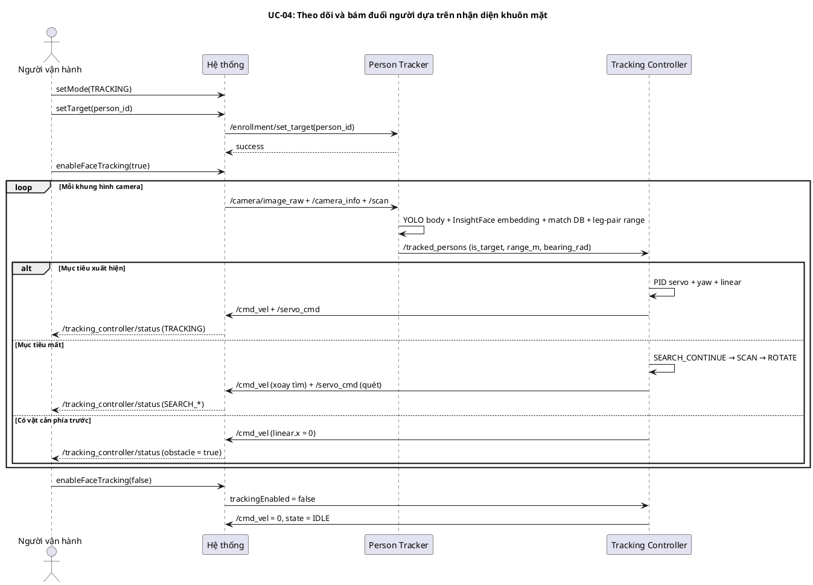
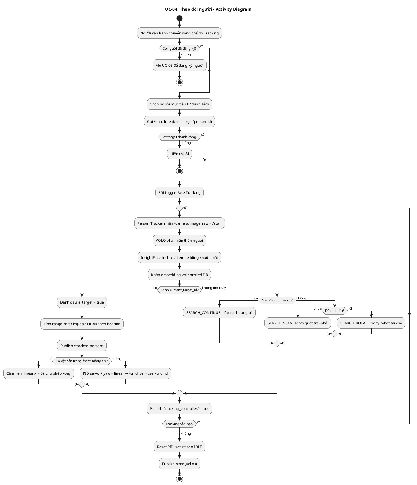
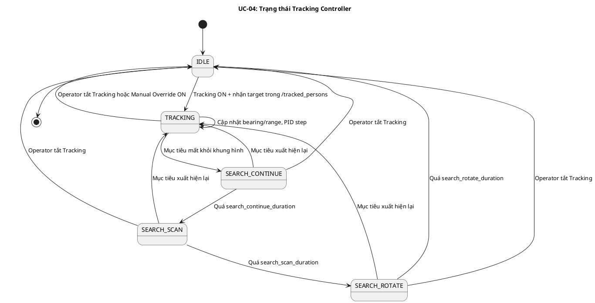
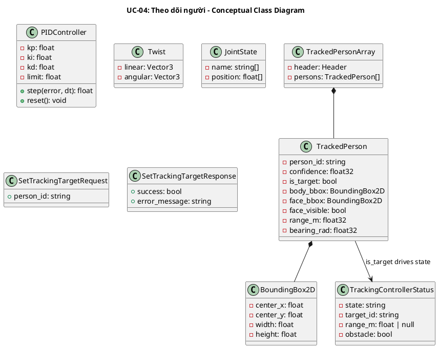
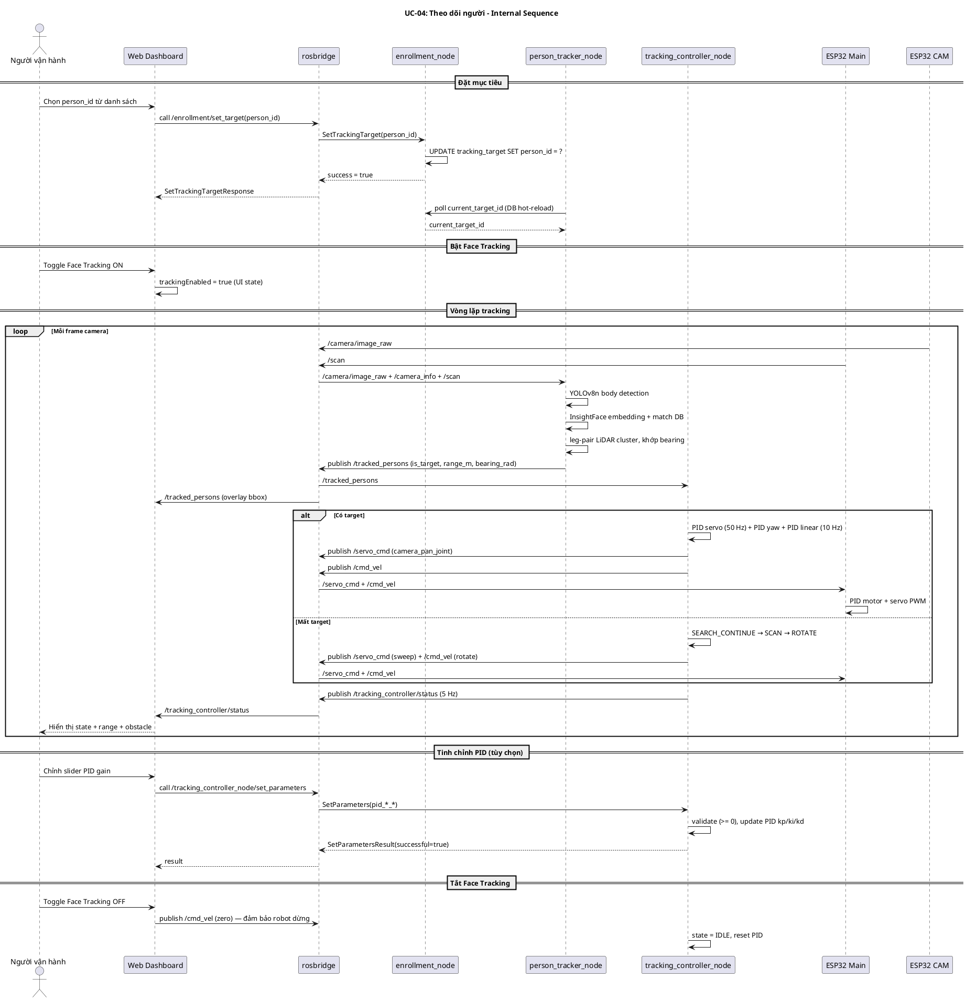
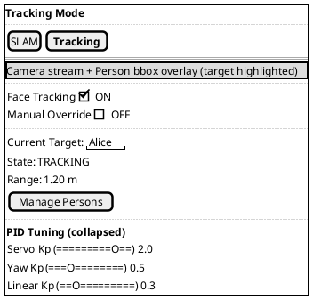

## UC-04: Theo dõi và bám đuổi người dựa trên nhận diện khuôn mặt

### Mô tả use case

| Mục                            | Nội dung                                                                                                                                                                                                                                                                                                                                                                                                                                                                                                                                                                                                                                                                                                                                                                                                                                                                                                                                                                                                                                                                                                                                                                                                                                                                                                                                                                                                                                                                                                                    |
| ------------------------------ | --------------------------------------------------------------------------------------------------------------------------------------------------------------------------------------------------------------------------------------------------------------------------------------------------------------------------------------------------------------------------------------------------------------------------------------------------------------------------------------------------------------------------------------------------------------------------------------------------------------------------------------------------------------------------------------------------------------------------------------------------------------------------------------------------------------------------------------------------------------------------------------------------------------------------------------------------------------------------------------------------------------------------------------------------------------------------------------------------------------------------------------------------------------------------------------------------------------------------------------------------------------------------------------------------------------------------------------------------------------------------------------------------------------------------------------------------------------------------------------------------------------------------- |
| Phụ thuộc                      |                                                                                                                                                                                                                                                                                                                                                                                                                                                                                                                                                                                                                                                                                                                                                                                                                                                                                                                                                                                                                                                                                                                                                                                                                                                                                                                                                                                                                                                                                                                             |
| Mục đích                       | Người vận hành cần robot tự động bám theo một cá nhân cụ thể trong môi trường (ví dụ: đi theo chủ nhân quanh nhà, theo trợ lý trong kho). PM cho phép chọn người mục tiêu từ danh sách đã đăng ký, hệ thống dùng camera + LiDAR để nhận diện và điều khiển robot bám đuổi an toàn.                                                                                                                                                                                                                                                                                                                                                                                                                                                                                                                                                                                                                                                                                                                                                                                                                                                                                                                                                                                                                                                                                                                                                                                                                                          |
| Mô tả                          | Người vận hành chuyển sang chế độ Tracking, chọn một người đã đăng ký làm mục tiêu, bật toggle Face Tracking. Hệ thống sử dụng YOLOv8 để phát hiện thân người, InsightFace để khớp khuôn mặt với embedding đã lưu, kết hợp leg-pair LiDAR để ước lượng khoảng cách, sau đó điều khiển servo camera + bánh xe bằng PID để giữ mục tiêu ở giữa khung hình và ở khoảng cách mong muốn.                                                                                                                                                                                                                                                                                                                                                                                                                                                                                                                                                                                                                                                                                                                                                                                                                                                                                                                                                                                                                                                                                                                                         |
| Actor chính                    | Người vận hành (Operator)                                                                                                                                                                                                                                                                                                                                                                                                                                                                                                                                                                                                                                                                                                                                                                                                                                                                                                                                                                                                                                                                                                                                                                                                                                                                                                                                                                                                                                                                                                   |
| Actor liên quan                | YOLOv8n (phát hiện thân người), InsightFace buffalo_l (trích xuất embedding khuôn mặt), ESP32-CAM (luồng hình MJPEG), ESP32 main board (điều khiển động cơ + servo + LiDAR), SQLite face database (lưu embedding đã đăng ký)                                                                                                                                                                                                                                                                                                                                                                                                                                                                                                                                                                                                                                                                                                                                                                                                                                                                                                                                                                                                                                                                                                                                                                                                                                                                                                |
| Tiền điều kiện                 | 1. Robot đã bật nguồn và kết nối WiFi   2. Web dashboard đã kết nối rosbridge (status = connected)   3. ESP32-CAM đang stream `/camera/image_raw` và publish `/camera_info`   4. ESP32 main board đang publish `/scan` (LiDAR) và nhận `/cmd_vel`, `/servo_cmd`   5. Có ít nhất một người đã được đăng ký thành công (UC-05)   6. Hệ thống đang ở chế độ Tracking, không bật Manual Override                                                                                                                                                                                                                                                                                                                                                                                                                                                                                                                                                                                                                                                                                                                                                                                                                                                                                                                                                                                                                                                                                                                 |
| Dãy lệnh thực hiện bình thường | 1. Người vận hành chọn chế độ "Tracking" trên Mode Controller   2. Dashboard tự động chuyển primary viewport sang camera   3. Người vận hành mở "Manage Persons", chọn một người đã đăng ký và đặt làm mục tiêu   4. Dashboard gọi service `/enrollment/set_target(person_id)`   5. `enrollment_node` cập nhật target trong DB, `person_tracker_node` đọc lại `current_target_id`   6. Người vận hành bật toggle "Face Tracking" → `trackingEnabled = true`   7. `person_tracker_node` nhận khung hình từ `/camera/image_raw`, phát hiện thân người bằng YOLOv8n, dò khuôn mặt bằng InsightFace   8. Hệ thống khớp embedding khuôn mặt với DB, gán `is_target = true` cho người trùng `current_target_id`   9. `person_tracker_node` tính khoảng cách (`range_m`) từ leg-pair LiDAR khớp theo bearing và publish `/tracked_persons` (TrackedPersonArray)   10. `tracking_controller_node` nhận target, chạy PID servo (giữ bearing ≈ 0), PID yaw (handoff khi servo vượt ngưỡng), PID linear (giữ khoảng cách trong [target_distance_min, target_distance_max])   11. Hệ thống publish `/cmd_vel` đến ESP32 và `/servo_cmd` đến servo `camera_pan_joint`, robot quay đầu và di chuyển bám theo người   12. `/tracking_controller/status` được publish 5 Hz để hiển thị trạng thái (TRACKING/SEARCH\_\*), khoảng cách hiện tại và cờ obstacle trên dashboard   13. Khi muốn dừng, người vận hành tắt toggle "Face Tracking" → robot dừng (`/cmd_vel = 0`), controller về trạng thái IDLE |
| Hậu điều kiện (thành công)     | Robot bám sát mục tiêu trong khoảng cách [target_distance_min, target_distance_max], servo + bánh xe phối hợp giữ mục tiêu ở giữa khung hình; trạng thái controller = TRACKING                                                                                                                                                                                                                                                                                                                                                                                                                                                                                                                                                                                                                                                                                                                                                                                                                                                                                                                                                                                                                                                                                                                                                                                                                                                                                                                                              |
| Hậu điều kiện (thất bại)       | Robot dừng tại vị trí an toàn (`/cmd_vel = 0`), controller chuyển về SEARCH\_\* hoặc IDLE; PID state được reset; mục tiêu mất nhưng `current_target_id` vẫn được giữ để sẵn sàng theo dõi lại khi người mục tiêu xuất hiện trong khung hình.                                                                                                                                                                                                                                                                                                                                                                                                                                                                                                                                                                                                                                                                                                                                                                                                                                                                                                                                                                                                                                                                                                                                                                                                                                                                                |
| Xử lý ngoại lệ                 | Mục tiêu rời khung hình ngắn (< 0.5s) → SEARCH_CONTINUE: robot tiếp tục quay theo hướng cũ   Mục tiêu mất lâu hơn → SEARCH_SCAN: servo quét trái-phải; nếu vẫn không thấy → SEARCH_ROTATE: robot xoay tại chỗ   Vật cản trước robot trong front safety arc → cấm tiến (`linear.x = 0`), vẫn cho xoay   `/camera_info` chưa nhận được → bỏ frame, log cảnh báo throttle   TF lookup thất bại (camera → laser_link) → bỏ frame, không cập nhật bearing   Không tìm được leg-pair khớp bearing → `range_m = NaN`, controller bỏ qua linear command, chỉ chạy servo/yaw   Mất kết nối rosbridge → robot dừng (safety timeout firmware)                                                                                                                                                                                                                                                                                                                                                                                                                                                                                                                                                                                                                                                                                                                                                                                                                                                                        |

### Lược đồ tuần tự

### Lược đồ hoạt động

### Lược đồ trạng thái

### Lược đồ lớp ý niệm

### Phân rã thành phần PM

#### Controller: `DashboardWebApp`

- **Nhiệm vụ**: Cho phép người vận hành chọn mục tiêu, bật/tắt tracking, hiển thị
  trạng thái controller real-time và tinh chỉnh PID gain.
- **Service call**: `/enrollment/set_target` (slam_car_interfaces/SetTrackingTarget),
  `/enrollment/list_persons` (slam_car_interfaces/ListPersons),
  `/tracking_controller_node/set_parameters` (rcl_interfaces/SetParameters)
- **Topic publish**: `/cmd_vel` (chỉ khi Manual Override hoặc khi tắt tracking để
  reset về 0)
- **Topic subscribe**: `/tracked_persons` (slam_car_interfaces/TrackedPersonArray),
  `/tracking_controller/status` (std_msgs/String JSON)
- **Input**: Click "Set as target" trên thẻ người → `SetTrackingTargetRequest { person_id }`;
  Toggle Face Tracking → cập nhật state UI
- **Output thành công**: Hiển thị tên mục tiêu, badge trạng thái (TRACKING/SEARCH\_\*),
  range_m, cảnh báo obstacle
- **Output lỗi**: Toast notification khi `/enrollment/set_target` thất bại hoặc
  parse JSON status thất bại

#### UseCase: `PersonTrackingUseCase`

- **Nhiệm vụ**: Orchestrate luồng nhận diện + bám đuổi người mục tiêu.
- **Input**: `person_id: string` (mục tiêu), `enabled: bool` (bật/tắt tracking)
- **Output**: `TrackedPersonArray` (real-time), `TrackingControllerStatus` (5 Hz)
- **Gọi đến**:
  - `rosbridge.callService(/enrollment/set_target)` — đặt mục tiêu
  - `rosbridge.subscribe(/tracked_persons)` — overlay bbox trên camera viewport
  - `rosbridge.subscribe(/tracking_controller/status)` — hiển thị state + range
  - `rosbridge.callService(/tracking_controller_node/set_parameters)` — chỉnh
    9 gain PID (servo/yaw/linear × kp/ki/kd)

#### Node: `person_tracker_node`

- **Nhiệm vụ**: Phát hiện thân người, nhận diện khuôn mặt, fuse với LiDAR
  leg-pair để gán range, publish kết quả tracking.
- **Subscribe**:
  - `/camera/image_raw` (sensor_msgs/Image)
  - `/camera_info` (sensor_msgs/CameraInfo)
  - `/scan` (sensor_msgs/LaserScan)
- **Publish**: `/tracked_persons` (slam_car_interfaces/TrackedPersonArray)
- **Phụ thuộc DB**: `~/.slam_car/face_db.sqlite` — hot-reload embeddings khi DB
  thay đổi (so sánh `db_last_modified`)
- **Tham số chính**: `embedding_threshold`, `leg_cluster_min_width`,
  `leg_cluster_max_width`, `leg_pair_min_gap`, `leg_pair_max_gap`,
  `bearing_match_tolerance`

#### Node: `tracking_controller_node`

- **Nhiệm vụ**: Điều phối servo camera + bánh xe để bám mục tiêu, xử lý các
  trạng thái tìm kiếm khi mất mục tiêu, đảm bảo an toàn trước vật cản.
- **Subscribe**:
  - `/tracked_persons` (slam_car_interfaces/TrackedPersonArray)
  - `/scan` (sensor_msgs/LaserScan) — front safety arc check
- **Publish**:
  - `/cmd_vel` (geometry_msgs/Twist) → ESP32 main board
  - `/servo_cmd` (sensor_msgs/JointState, name = `camera_pan_joint`)
  - `/tracking_controller/status` (std_msgs/String chứa JSON
    `{state, target_id, range_m, obstacle}`)
- **Vòng lặp**:
  - Servo loop 50 Hz — PID servo bám bearing
  - Wheel loop 10 Hz — PID yaw (handoff khi |servo_angle| > servo_handoff_threshold)
    - PID linear (giữ khoảng cách)
  - Lost-target check 10 Hz — chuyển trạng thái IDLE/TRACKING/SEARCH\_\*
  - Status loop 5 Hz — publish JSON status
- **Tham số tunable runtime**: 9 PID gain (`pid_servo_kp/ki/kd`,
  `pid_wheel_yaw_kp/ki/kd`, `pid_linear_kp/ki/kd`)

#### Node: `enrollment_node` _(chỉ phần liên quan UC-04)_

- **Nhiệm vụ**: Quản lý mục tiêu hiện tại trong DB.
- **Service liên quan UC này**:
  - `/enrollment/set_target` (SetTrackingTarget) — cập nhật `current_target_id`
  - `/enrollment/get_target` (GetTrackingTarget) — đọc target hiện tại
  - `/enrollment/list_persons` (ListPersons) — liệt kê danh sách enrolled

#### Firmware: `ESP32 Main`

- **Nhiệm vụ**: Nhận `/cmd_vel` điều khiển động cơ qua TB6612FNG, nhận
  `/servo_cmd` điều khiển servo `camera_pan_joint`, publish `/scan` từ LDS02RR.
- **Subscribe**: `/cmd_vel`, `/servo_cmd`
- **Publish**: `/scan`, `/odom`

#### Firmware: `ESP32 CAM`

- **Nhiệm vụ**: Stream MJPEG, được `cam_bridge_node` chuyển sang `/camera/image_raw`.
- **Publish (qua bridge)**: `/camera/image_raw`, `/camera_info`

#### Lược đồ tuần tự nội bộ PM

#### Giao diện

##### Giao diện mẫu

##### Giao diện ứng dụng

Chưa hiện thực. Sẽ bổ sung ảnh chụp màn hình khi hoàn thành.

### Bảng tham chiếu dò vết

| Use Case | Component                | Topic/Service                                                                                | Node/Store          | Phương thức                                                            | Ghi chú                       |
| -------- | ------------------------ | -------------------------------------------------------------------------------------------- | ------------------- | ---------------------------------------------------------------------- | ----------------------------- |
| UC-04    | ModeController           | (UI state)                                                                                   | useDashboardStore   | setPrimaryMode('tracking')                                             | Chuyển viewport sang camera   |
| UC-04    | EnrollModal              | SRV `/enrollment/list_persons`                                                               | useEnrollmentStore  | fetchPersons()                                                         | Liệt kê người đã đăng ký      |
| UC-04    | EnrollModal              | SRV `/enrollment/set_target`                                                                 | useEnrollmentStore  | setTarget(person_id)                                                   | Đặt mục tiêu theo dõi         |
| UC-04    | TrackingControls         | (UI state) + PUB `/cmd_vel` zero on disable                                                  | useDashboardStore   | setTrackingEnabled()                                                   | Bật/tắt face tracking         |
| UC-04    | TrackingStatus           | SUB `/tracking_controller/status`                                                            | useTopic            | parseTrackingControllerStatus()                                        | State + range + obstacle      |
| UC-04    | PersonOverlay            | SUB `/tracked_persons`                                                                       | useTopic            | handleTrackedPersons()                                                 | Overlay bbox trên camera      |
| UC-04    | PidTuner                 | SRV `/tracking_controller_node/set_parameters`                                               | usePidTuner         | setParam()                                                             | 9 PID gain runtime            |
| UC-04    | person_tracker_node      | SUB `/camera/image_raw`, `/scan`, PUB `/tracked_persons`                                     | person_tracker      | \_image_callback()                                                     | YOLO + InsightFace + leg-pair |
| UC-04    | tracking_controller_node | SUB `/tracked_persons`, `/scan`, PUB `/cmd_vel`, `/servo_cmd`, `/tracking_controller/status` | tracking_controller | \_tracked_callback() / \_servo_control_loop() / \_wheel_control_loop() | PID + state machine           |
| UC-04    | enrollment_node          | SRV `/enrollment/set_target`, `/enrollment/get_target`                                       | enrollment_node     | \_set_target_callback()                                                | Quản lý current_target_id     |
| UC-04    | ESP32 Main               | SUB `/cmd_vel`, `/servo_cmd`, PUB `/scan`                                                    | ros_bridge          | cmd_vel_callback() / servo_cmd_callback()                              | Motor + servo + LiDAR         |
| UC-04    | ESP32 CAM                | PUB MJPEG → cam_bridge_node `/camera/image_raw`                                              | cam_bridge_node     | publish_image()                                                        | Camera stream                 |

### Tiêu chí kiểm thử

| Tiêu chí                | Phép thử                                                                                                     | Kết quả mong đợi                                                                              | Ghi chú                                            |
| ----------------------- | ------------------------------------------------------------------------------------------------------------ | --------------------------------------------------------------------------------------------- | -------------------------------------------------- |
| Toàn diện (coverage)    | Đối chiếu Activity Diagram ↔ Sequence Diagram: mọi luồng (TRACKING, SEARCH\_\*, IDLE, obstacle) đều thể hiện | Không bỏ sót luồng chính lẫn ngoại lệ                                                         | Rà soát chéo giữa mục 2 và mục 3                   |
| Nhất quán               | Rà soát tên topic/service/state giữa các lược đồ trong cùng UC                                               | Không mâu thuẫn (vd: state TRACKING/SEARCH_CONTINUE/SEARCH_SCAN/SEARCH_ROTATE/IDLE)           | Đặc biệt kiểm tra mục 5–6                          |
| Truy vết                | Đối chiếu bảng tham chiếu (mục 7) với lược đồ tuần tự nội bộ (mục 6.5)                                       | Mọi tương tác trong sequence đều có entry                                                     | Kiểm tra không thiếu topic/service                 |
| Đặt mục tiêu            | Chọn người đã đăng ký → gọi `/enrollment/set_target`                                                         | Service trả `success = true`, `person_tracker_node` gán `is_target = true` cho đúng person_id | Kiểm tra cả khi đổi target trong lúc đang tracking |
| Nhận diện               | Người mục tiêu xuất hiện trong khung hình ở khoảng cách 1–3 m                                                | `confidence ≥ embedding_threshold`, `is_target = true` trong `/tracked_persons`               | Embedding cosine similarity ≥ ngưỡng               |
| Khoảng cách bằng LiDAR  | Người đứng cách robot 1.5 m trong tầm LiDAR                                                                  | `range_m` ≈ 1.5 ± 0.2 m, leg-pair khớp với bearing camera                                     | Sai lệch < bearing_match_tolerance                 |
| Bám servo               | Người di chuyển ngang trong khung hình                                                                       | Servo `camera_pan_joint` xoay theo, giữ bearing ≈ 0                                           | PID servo loop 50 Hz                               |
| Handoff servo → bánh xe | Servo vượt `servo_handoff_threshold` (0.52 rad)                                                              | Robot xoay theo (yaw command), servo dần về 0                                                 | Tránh kẹt servo ở góc giới hạn                     |
| Giữ khoảng cách         | Người đi xa quá `distance_too_far` (2.5 m)                                                                   | Robot tăng `linear.x` để bám sát; người lại gần `distance_too_close` → robot dừng tiến        | PID linear giữ trong [1.0, 1.5] m                  |
| Mất mục tiêu ngắn       | Người che mặt 0.3 s rồi mở lại                                                                               | Controller giữ TRACKING, không chuyển SEARCH\_\*                                              | `lost_timeout = 0.5 s`                             |
| Tìm kiếm khi mất        | Người rời khung hình quá 0.5 s                                                                               | Chuyển SEARCH_CONTINUE → SEARCH_SCAN → SEARCH_ROTATE; quay về TRACKING khi thấy lại           | Test từng nhánh state                              |
| Front safety arc        | Đặt vật cản trong front_safety_distance (0.3 m) khi đang TRACKING                                            | `linear.x = 0`, `obstacle = true` trong status; vẫn cho xoay                                  | Robot không đâm                                    |
| Tinh chỉnh PID runtime  | Gọi `/tracking_controller_node/set_parameters` với `pid_servo_kp = 3.0`                                      | `SetParametersResult.successful = true`, gain áp dụng ngay không cần restart                  | Reject negative gain                               |
| Tắt tracking            | Toggle Face Tracking OFF khi đang TRACKING                                                                   | Robot dừng (`/cmd_vel = 0`), state = IDLE, PID reset                                          | Dashboard publish cmd_vel zero để đảm bảo dừng     |
| Manual Override         | Bật Manual Override khi tracking đang ON                                                                     | Tracking tự tắt, joystick lấy quyền điều khiển                                                | Tránh xung đột command                             |
| Hot-reload DB           | Thêm/xóa người trong lúc tracking đang chạy                                                                  | `person_tracker_node` reload embeddings trong vòng 1 s                                        | Phụ thuộc UC-05                                    |
