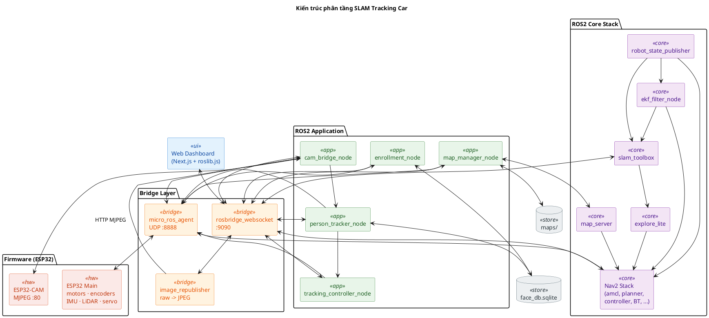
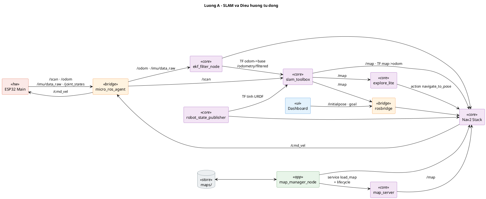
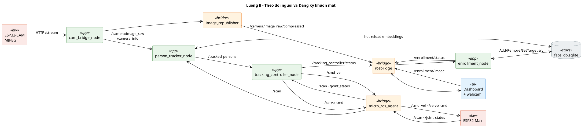

# Phân tích và thiết kế hệ thống

## Tổng quan kiến trúc ROS2

SLAM Tracking Car là hệ thống ROS2 Humble gồm bốn tầng chức năng, trao đổi dữ liệu với nhau qua lớp truyền tin DDS (CycloneDDS):

1. **Tầng giao diện người dùng (Web Dashboard)** — Trang web dựng bằng Next.js cùng thư viện `roslib.js`, kết nối tới ROS thông qua máy chủ `rosbridge` chạy giao thức WebSocket ở cổng 9090.
2. **Tầng ứng dụng ROS2** — Các nút (node) Python trong hai gói `slam_car_perception` và `slam_car_navigation` đảm nhận xử lý ảnh, nhận diện người, bám mục tiêu, quản lý bản đồ và điều phối vòng đời các nút Nav2.
3. **Tầng dịch vụ trung gian ROS2** — Các nút hệ thống có sẵn: `slam_toolbox`, các nút `nav2_*`, `explore_lite`, `robot_state_publisher`, `robot_localization` (bộ lọc EKF), `map_server`, `rosbridge_websocket`, `image_transport`.
4. **Tầng firmware (ESP32)** — Hai bo mạch ESP32 chạy micro-ROS, kết nối tới máy chủ `micro_ros_agent` qua WiFi UDP.

### Sơ đồ kiến trúc phân tầng

Bốn tầng được xếp theo chiều dọc. Dữ liệu cảm biến đi từ phần cứng lên trên, lệnh điều khiển đi từ trên xuống phần cứng.

### Luồng dữ liệu cảm biến và lệnh điều khiển

Để dễ theo dõi, hệ thống được tách thành hai luồng nghiệp vụ riêng.

#### Luồng A — Lập bản đồ SLAM và Điều hướng tự động

#### Luồng B — Theo dõi người và Đăng ký khuôn mặt

## Giải thích các nút (node)

### Tầng cầu nối (Bridge)

#### `micro_ros_agent` (gói `micro_ros_agent`)

- **Vai trò**: Làm cầu UDP4 giữa firmware ESP32 (chạy micro-ROS) và lớp truyền tin DDS của máy chủ ROS2. Lắng nghe ở cổng `8888`, miền (domain) số `42`.
- **Khởi chạy bởi**: `robot.launch.py` (mọi chế độ chạy với robot thật).
- **Lưu ý**: Toàn bộ chủ đề (topic) mà bo `ESP32 Main` thu/phát đều phải đi qua nút này.

#### `cam_bridge_node` (gói `slam_car_perception`, tệp `cam_bridge_node.py`)

- **Vai trò**: Đọc luồng MJPEG qua HTTP từ `ESP32-CAM` (địa chỉ lấy từ `firmware/.env`, mặc định `http://<CAM_IP>:80/stream`), chuyển sang kiểu `sensor_msgs/Image` rồi phát ra ROS.
- **Đăng ký nhận (subscribe)**: Không có (kết nối HTTP trực tiếp tới camera).
- **Phát (publish)**: `/camera/image_raw`, `/camera_info`.
- **Tham số**: `cam_url`, `frame_id` (mặc định `camera_optical_frame`), `fps`, `camera_fov_horizontal_deg`.

#### `rosbridge_websocket` (gói `rosbridge_server`)

- **Vai trò**: Cung cấp giao thức rosbridge dạng JSON ở `ws://0.0.0.0:9090`. Trình duyệt dùng `roslib.js` để phát/nhận chủ đề và gọi dịch vụ (service), hành động (action).
- **Tham số**: `max_message_size: 10MB` đủ để truyền ảnh nén.
- **Khởi chạy bởi**: `dashboard.launch.py`, `person_tracking.launch.py`.

#### `image_republisher` (gói `image_transport`)

- **Vai trò**: Phát lại `/camera/image_raw` (định dạng BGR8 cỡ ~9 MB/giây) thành `/camera/image_raw/compressed` (JPEG, ~500 KB/giây) để giảm băng thông cho phía web.
- **Tham số**: `compressed.jpeg_quality: 75`.

### Tầng nhận thức (`slam_car_perception`)

#### `enrollment_node` (tệp `enrollment_node.py`)

- **Vai trò**: Đăng ký người mới vào hệ thống nhận diện khuôn mặt. Nhận khung ảnh từ webcam của trình duyệt thông qua `rosbridge`, dò khuôn mặt bằng YOLOv8n, trích đặc trưng (embedding) bằng InsightFace `buffalo_l`, lưu vào cơ sở dữ liệu SQLite.
- **Đăng ký nhận**: `/enrollment/image` (kiểu `sensor_msgs/CompressedImage`).
- **Phát**: `/enrollment/status` (kiểu `slam_car_interfaces/EnrollmentStatus`).
- **Dịch vụ** (định nghĩa trong `slam_car_interfaces`): `AddPerson`, `RemovePerson`, `ListPersons`, `SetTrackingTarget`, `GetTrackingTarget`.
- **Lưu trữ**: tệp `~/.slam_car/face_db.sqlite`.

#### `person_tracker_node` (tệp `person_tracker_node.py`)

- **Vai trò**: Phát hiện và nhận diện người trong luồng video của ESP32-CAM. Quy trình xử lý: YOLOv8n dò vùng người → InsightFace cắt và trích đặc trưng khuôn mặt → so khớp cosine với cơ sở dữ liệu đặc trưng → kết hợp với cụm chân người trên `/scan` để ước lượng khoảng cách thực tế.
- **Đăng ký nhận**: `/camera/image_raw`, `/camera_info`, `/scan`, các phép biến đổi tọa độ TF (`camera_optical_frame` ↔ `laser_link`).
- **Phát**: `/tracked_persons` (kiểu `slam_car_interfaces/TrackedPersonArray`).
- **Tự nạp lại**: Theo dõi thời điểm chỉnh sửa cuối (`mtime`) của tệp SQLite, nạp lại đặc trưng người khi cơ sở dữ liệu thay đổi.

#### `tracking_controller_node` (tệp `tracking_controller_node.py`)

- **Vai trò**: Điều phối servo (xoay camera) và bánh xe để bám mục tiêu đã chọn. Bốn vòng định thời chạy song song: vòng servo 50 Hz, vòng bánh xe 10 Hz, vòng kiểm tra mất mục tiêu 10 Hz, vòng cập nhật trạng thái 5 Hz.
- **Đăng ký nhận**: `/tracked_persons`, `/joint_states`, `/scan`.
- **Phát**: `/cmd_vel` (kiểu `geometry_msgs/Twist`), `/servo_cmd` (kiểu `sensor_msgs/JointState`), `/tracking_controller/status` (kiểu `std_msgs/String`).
- **An toàn**: Dừng robot khi mất mục tiêu, tránh va chạm dựa trên `/scan`.

### Tầng dịch vụ trung gian ROS2

#### `robot_state_publisher`

- **Vai trò**: Đọc mô tả robot từ tệp URDF (`robot.urdf.xacro`) và phát các phép biến đổi tọa độ TF tĩnh giữa các khâu (link) của robot (`base_footprint` → `base_link` → `laser_link`, `camera_link`, `camera_optical_frame`, …) cùng tham số `robot_description`.

#### `ekf_filter_node` (gói `robot_localization`)

- **Vai trò**: Hợp nhất `/odom` (từ encoder bánh) với `/imu/data_raw` (từ IMU) bằng bộ lọc Kalman mở rộng (EKF) để tạo ra ước lượng tư thế ổn định cho khung tọa độ `odom → base_footprint`.
- **Phát**: `/odometry/filtered`, biến đổi TF `odom → base_footprint`.
- **Tham số**: `config/ekf.yaml`.

#### `slam_toolbox` (`async_slam_toolbox_node`)

- **Vai trò**: Lập bản đồ và định vị đồng thời (SLAM) 2D dạng đồ thị (graph-based), chạy bất đồng bộ. Tích hợp dữ liệu `/scan` cùng các phép biến đổi TF để dựng bản đồ.
- **Phát**: `/map` (kiểu `nav_msgs/OccupancyGrid`), `/map_metadata`, biến đổi TF `map → odom`.
- **Dịch vụ**: `/slam_toolbox/serialize_map`, `/slam_toolbox/save_map`, `/slam_toolbox/clear_map`.
- **Tham số**: `config/slam_toolbox.yaml`.

#### `explore_lite` (gói `m-explore-ros2`)

- **Vai trò**: Phát hiện đường biên (frontier) giữa vùng đã biết và chưa biết trên `/map`, sau đó gửi đích đến cho Nav2 để robot tự khám phá. Dashboard có thể bật hoặc tắt thông qua hành động (action).
- **Đăng ký nhận**: `/map`, `/map_updates`.
- **Khách hành động (action client)**: `/navigate_to_pose`.
- **Chủ đề phụ**: `/explore/resume` (kiểu Bool) — tạm dừng hoặc tiếp tục.

#### Cụm Nav2 (các nút có vòng đời)

Khởi động ở trạng thái chưa cấu hình (UNCONFIGURED), được `map_manager_node` kích hoạt khi chuyển sang chế độ điều hướng.

| Nút                 | Vai trò                                                                | Chủ đề / Hành động chính                                              |
| ------------------- | ---------------------------------------------------------------------- | --------------------------------------------------------------------- |
| `map_server`        | Nạp tệp bản đồ `.yaml/.pgm` đã lưu, phát ra làm bản đồ tĩnh.           | `/map`                                                                |
| `amcl`              | Định vị bằng phương pháp Monte Carlo trên bản đồ có sẵn.               | nhận `/scan`, `/initialpose`; phát `/amcl_pose`, biến đổi `map→odom`. |
| `planner_server`    | Sinh đường đi tổng thể (NavFn / SmacPlanner).                          | hành động `/compute_path_to_pose`.                                    |
| `controller_server` | Bộ điều khiển cục bộ (DWB / RPP) sinh `/cmd_vel` để bám đường đi.      | hành động `/follow_path`; phát `/cmd_vel`.                            |
| `bt_navigator`      | Cây hành vi (behavior tree) điều phối toàn bộ Nav2.                    | hành động `/navigate_to_pose`, `/navigate_through_poses`.             |
| `behavior_server`   | Các hành vi cứu nguy (xoay tại chỗ, lùi, chờ, đi theo hướng).          | hành động `/spin`, `/backup`, …                                       |
| `lifecycle_manager` | Kích hoạt / hủy kích hoạt các nút Nav2 (gói `nav2_lifecycle_manager`). | dịch vụ `/lifecycle_manager_*/manage_nodes`.                          |

#### `map_manager_node` (gói `slam_car_navigation`)

- **Vai trò**: Quản lý chuyển đổi giữa hai chế độ lập bản đồ và điều hướng. Liệt kê bản đồ đã lưu, nạp bản đồ vào `map_server` và điều khiển vòng đời của cụm Nav2.
- **Dịch vụ**: `/map_manager/list_maps`, `/map_manager/load_map`, `/map_manager/set_mode`.

### Tầng firmware (PlatformIO + micro-ROS)

#### `ESP32 Main` (`firmware/src/main.cpp`)

- **Vai trò**: Bo điều khiển trung tâm gồm trình điều khiển động cơ (chip TB6612FNG), encoder bánh, cảm biến quán tính IMU (MPU6050), LiDAR LDS02RR và servo. Bo này cũng là một nút micro-ROS.
- **Phát**: `/scan` (LaserScan), `/odom` (Odometry), `/imu/data_raw` (Imu), `/joint_states` (JointState cho khớp `camera_pan_joint`).
- **Đăng ký nhận**: `/cmd_vel` (Twist) → điều khiển động cơ kiểu PID; `/servo_cmd` (JointState) → đặt góc xoay servo.
- **Mô-đun**: `motors`, `encoders`, `imu`, `lidar`, `servos`, `safety`, `ros_bridge` (xem đặc tả `firmware-modules`).

#### `ESP32-CAM` (`firmware/src/cam_main.cpp`)

- **Vai trò**: Phát luồng video MJPEG qua máy chủ HTTP cổng 80. Bo này không phải nút micro-ROS, mà được `cam_bridge_node` chủ động kéo dữ liệu về.
- **Đầu ra**: Điểm cuối HTTP `/stream` (định dạng multipart MJPEG).

## Bảng tổng hợp các tệp khởi chạy (launch file)

| Tệp khởi chạy               | Bao gồm các nút                                                                                                                                                                                                                                                                |
| --------------------------- | ------------------------------------------------------------------------------------------------------------------------------------------------------------------------------------------------------------------------------------------------------------------------------ |
| `robot.launch.py`           | `micro_ros_agent`, `robot_state_publisher`, `cam_bridge_node`, `ekf_filter_node`                                                                                                                                                                                               |
| `slam.launch.py`            | nội dung `robot.launch.py` + `slam_toolbox` + `rviz2`                                                                                                                                                                                                                          |
| `navigation.launch.py`      | nội dung `robot.launch.py` + `nav2_bringup` + `rviz2`                                                                                                                                                                                                                          |
| `simulation.launch.py`      | `gazebo`, `robot_state_publisher`, `ros_gz_bridge`, `rviz2`                                                                                                                                                                                                                    |
| `dashboard.launch.py`       | nội dung `robot.launch.py` + `rosbridge_websocket` + `image_republisher` + `map_manager_node` + `slam_toolbox` + `explore_lite` + các nút Nav2 có vòng đời (`map_server`, `amcl`, `controller_server`, `planner_server`, `bt_navigator`, `behavior_server`)                    |
| `person_tracking.launch.py` | nội dung `robot.launch.py` + `enrollment_node` + `person_tracker_node` + `tracking_controller_node` + `rosbridge_websocket`                                                                                                                                                    |

## Giao diện tùy biến (`slam_car_interfaces`)

- **Bản tin (message)**: `RobotMode`, `BoundingBox2D`, `EnrolledPerson`, `EnrollmentStatus`, `TrackedPerson`, `TrackedPersonArray`.
- **Dịch vụ (service)**: `SetMode`, `ListMaps`, `LoadMap`, `AddPerson`, `RemovePerson`, `ListPersons`, `SetTrackingTarget`, `GetTrackingTarget`.
