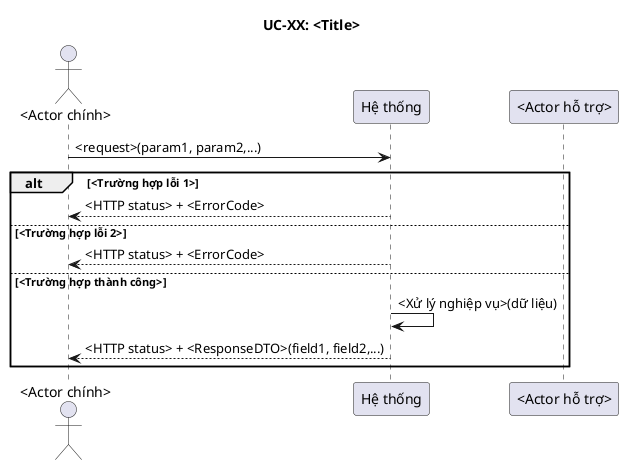
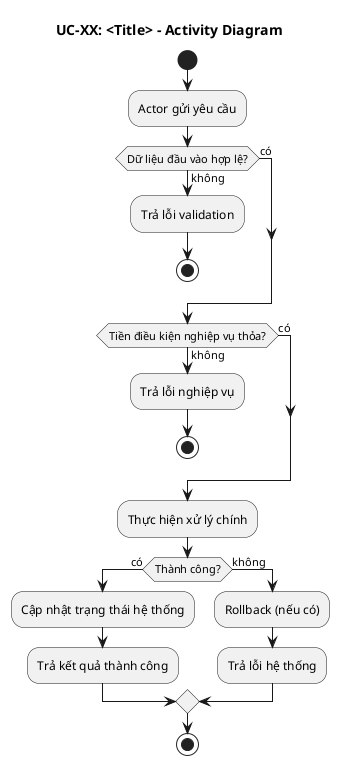
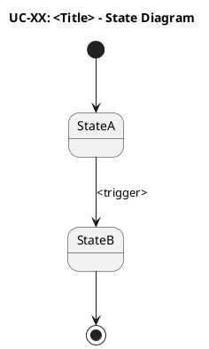
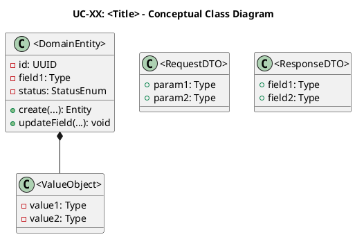
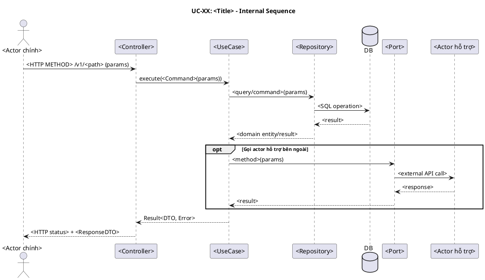
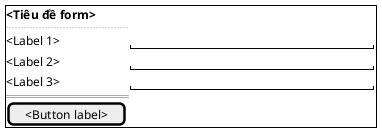

## UC-XX: <Tên use case>

### Mô tả use case

| Mục                            | Nội dung                                                                                                        |
| ------------------------------ | --------------------------------------------------------------------------------------------------------------- |
| Phụ thuộc                      | <Danh sách UC liên quan. Nếu không có, ghi "Không">                                                             |
| Mục đích                       | <Nêu rõ tình huống mà actor cần PM trợ giúp, ích lợi cụ thể PM mang lại cho actor trong tình huống này>         |
| Mô tả                          | <Mô tả ngắn gọn mục đích chức năng từ góc nhìn khách hàng>                                                      |
| Actor chính                    | <Actor trực tiếp kích hoạt use case — vai trò trong tổ chức, không phải "User" hay "Admin">                     |
| Actor liên quan                | <Các actor tham gia gián tiếp: actor hỗ trợ PM (vd: Stripe), actor nhận kết quả,... Nếu không có, ghi "Không">  |
| Tiền điều kiện                 | <Điều kiện bắt buộc trước khi thực hiện>                                                                        |
| Dãy lệnh thực hiện bình thường | 1. <Bước 1>   2. <Bước 2>   3. <Bước 3>                                                                   |
| Hậu điều kiện (thành công)     | <Trạng thái hệ thống sau khi use case hoàn thành thành công>                                                    |
| Hậu điều kiện (thất bại)       | <Trạng thái hệ thống khi use case thất bại — dữ liệu có rollback không, trạng thái entity nào bị ảnh hưởng,...> |
| Xử lý ngoại lệ                 | <Ngoại lệ 1> → <Hành vi hệ thống>   <Ngoại lệ 2> → <Hành vi hệ thống>                                        |

### Lược đồ tuần tự

<!-- Lược đồ cấp 1: Actor ↔ PM (hệ thống là hộp đen).
     Mọi thông điệp đi đến PM PHẢI có tham số dữ liệu để định nghĩa chức năng cho PM.
     Lược đồ cấp 2 (nội bộ PM) nằm ở mục 6. -->

### Lược đồ hoạt động

<!-- Dùng để đối chiếu với lược đồ tuần tự (mục 2), kiểm tra độ phủ kịch bản
     và xác định thêm luồng ngoại lệ nếu thiếu. -->

<!-- Chỉ giữ mục này khi use case có thay đổi trạng thái -->

### Lược đồ trạng thái

<!-- Ràng buộc chuyển trạng thái sẽ thành CHECK constraint trong DB
     và business rule trong lớp UseCase. -->

### Lược đồ lớp ý niệm

<!-- Các domain entity, value object, DTO tham gia vào use case.
     Thuộc tính và phương thức ở mức ý niệm (conceptual), lấy từ thực tế.
     Tên lớp phải nhất quán với các lược đồ khác trong cùng UC. -->

### Phân rã thành phần PM

<!-- Xem PM là một hệ thống. Phân rã các thành phần xử lý UC này
     theo kiến trúc Clean Architecture + DDD:
     Controller (lớp biên) → UseCase (lớp xử lý) → Repository (lớp thực thể) → DB
     Mô tả nhiệm vụ, API, inputs/outputs cho từng thành phần. -->

#### Controller: `<ControllerName>`

- **Nhiệm vụ**: Nhận HTTP request từ actor, xác thực đầu vào, ủy thác cho
  UseCase.
- **Endpoint**: `<METHOD> /v1/<path>`
- **Input**: `<RequestDTO>` — `{ field1: Type, field2: Type, ... }`
- **Output thành công**: `<HTTP status>` + `<ResponseDTO>` —
  `{ field1: Type, ... }`
- **Output lỗi**: `<HTTP status>` + `JsendResponse` — `{ errorCode, message }`

#### UseCase: `<UseCaseName>`

- **Nhiệm vụ**: Orchestrate nghiệp vụ cho UC này.
- **Input**: `<Command/Query>` — `{ field1: Type, ... }`
- **Output**: `Result<ResponseDTO, Error>`
- **Gọi đến**:
  - `<Repository>.method()` — <mục đích>
  - `<Port>.method()` — <mục đích> (nếu có actor hỗ trợ bên ngoài)
- **Phát sinh sự kiện**: `<DomainEvent>` (nếu có)

#### Repository: `<RepositoryName>`

- **Nhiệm vụ**: Truy xuất/lưu trữ domain entity `<Entity>`.
- **Phương thức liên quan đến UC**:
  - `findById(id): Optional<Entity>` — <mục đích>
  - `save(entity): Entity` — <mục đích>
- **Table**: `<table_name>`

#### Port: `<PortName>` _(nếu có)_

- **Nhiệm vụ**: Giao tiếp với actor hỗ trợ bên ngoài (vd: Stripe, Email
  Service,...).
- **Phương thức liên quan đến UC**:
  - `methodName(params): ReturnType` — <mục đích>

#### Lược đồ tuần tự nội bộ PM

<!-- Lược đồ cấp 2: phân rã tương tác nội bộ hệ thống.
     Diễn tả cách các thành phần PM phối hợp xử lý UC. -->

#### Giao diện

##### Giao diện mẫu

<!-- Wireframe mô tả giao diện mặc định của UC sử dụng PlantUML Salt.
     Chỉ thể hiện trạng thái form mặc định (default state).
     Tham khảo: https://plantuml.com/salt -->

##### Giao diện ứng dụng

<!-- Ảnh chụp màn hình giao diện thực tế sau khi hiện thực.
     Bổ sung khi hoàn thành implementation. -->

Chưa hiện thực. Sẽ bổ sung ảnh chụp màn hình khi hoàn thành.
