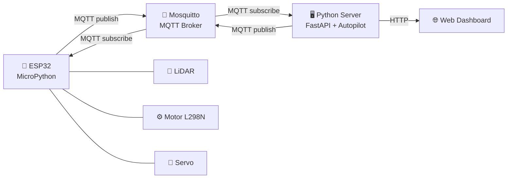

# 🚗 Phân Tích Dự Án Xe Tự Lái — Đã Làm & Còn Thiếu

> **Cập nhật lần cuối:** 2026-03-29 07:35 — Sau khi fix config, dashboard, requirements

## Tổng Quan Kiến Trúc

---

## ✅ Chức Năng ĐÃ LÀM ĐƯỢC

### 1. Firmware ESP32 — esp32_main.py

| Chức năng | Trạng thái | Chi tiết |
|-----------|------------|----------|
| Kết nối WiFi | ✅ Hoàn thành | `connect_wifi()` — retry 20 lần |
| Điều khiển Motor (L298N) | ✅ Hoàn thành | `set_motor()` — FORWARD/BACKWARD/STOP, PWM 0-100% |
| Điều khiển Motor vi sai | ✅ Hoàn thành | `set_motor_differential()` — điều khiển riêng bánh trái/phải |
| Điều khiển Servo | ✅ Hoàn thành | `set_servo()` — góc 0-180°, pulse 0.5ms-2.5ms |
| Đọc LiDAR UART | ⚠️ Placeholder | `read_lidar_simple()` — có khung nhưng **chưa parse protocol thật** |
| MQTT Client | ✅ Hoàn thành | Kết nối broker, subscribe commands, publish sensor data |
| Last Will Testament | ✅ Hoàn thành | Tự báo offline khi mất kết nối |
| Nhận lệnh từ Server | ✅ Hoàn thành | `on_command()` — xử lý MOTOR, SERVO, STOP, SET_MODE |
| Publish LiDAR data | ✅ Hoàn thành | Mỗi 500ms gửi dữ liệu LiDAR lên server |
| Auto-reconnect MQTT | ✅ Hoàn thành | Try/except với reconnect khi mất kết nối |

### 2. MQTT Manager — broker_manager.py

| Chức năng | Trạng thái | Chi tiết |
|-----------|------------|----------|
| Kết nối MQTT Broker | ✅ Hoàn thành | Async connect, loop_start |
| Subscribe multi-topic | ✅ Hoàn thành | GPS, LiDAR, Speed, Status, Alerts (QoS 0/1/2) |
| Handler GPS | ✅ Hoàn thành | Parse lat/lon/alt/accuracy |
| Handler LiDAR | ✅ Hoàn thành | Parse distances, tính min_distance, phát hiện obstacle |
| Handler Speed | ✅ Hoàn thành | Cập nhật motor state |
| Handler Status | ✅ Hoàn thành | Online/offline tracking |
| Handler Alerts | ✅ Hoàn thành | Parse level + message, lưu vào vehicle state |
| Send Command | ✅ Hoàn thành | `send_motor()`, `send_servo()`, `send_mode()` |
| Phát hiện vật cản | ✅ Hoàn thành | So sánh `min_distance` với `LIDAR_OBSTACLE_THRESHOLD_CM` |
| Dừng khẩn cấp khi gặp vật cản | ✅ Hoàn thành | Tự gửi STOP khi obstacle + đang autopilot |

### 3. Vehicle State — vehicle_state.py

| Chức năng | Trạng thái | Chi tiết |
|-----------|------------|----------|
| Model trạng thái xe | ✅ Hoàn thành | GPS, LiDAR, Motor, Servo, Alerts, Waypoints |
| Thread-safe | ✅ Hoàn thành | `threading.RLock()` cho mọi thao tác |
| 5 chế độ lái | ✅ Hoàn thành | MANUAL, AUTOPILOT, WAYPOINT, HYBRID, EMERGENCY_STOP |
| Multi-vehicle registry | ✅ Hoàn thành | `get_vehicle()`, `list_vehicles()` — hỗ trợ nhiều xe |
| Alert system | ✅ Hoàn thành | INFO/WARNING/CRITICAL, giữ tối đa 100 alert |
| Serialize to dict | ✅ Hoàn thành | `to_dict()` cho API response |

### 4. REST API — app.py

| Chức năng | Trạng thái | Chi tiết |
|-----------|------------|----------|
| Danh sách xe | ✅ Hoàn thành | `GET /vehicles` |
| Trạng thái xe | ✅ Hoàn thành | `GET /vehicles/{id}` |
| Đổi chế độ lái | ✅ Hoàn thành | `POST /vehicles/{id}/mode` |
| Điều khiển thủ công | ✅ Hoàn thành | `POST /vehicles/{id}/control` — motor + servo |
| Dừng khẩn cấp | ✅ Hoàn thành | `POST /vehicles/{id}/stop` |
| Quản lý Waypoints | ✅ Hoàn thành | POST/GET/DELETE waypoints |
| Xem Alerts | ✅ Hoàn thành | `GET /vehicles/{id}/alerts` |
| CORS | ✅ Hoàn thành | Cho phép tất cả origins |
| Input validation | ✅ Hoàn thành | Pydantic models với Field validators |

### 5. Autopilot Engine — engine.py

| Chức năng | Trạng thái | Chi tiết |
|-----------|------------|----------|
| Autopilot loop | ✅ Hoàn thành | Async loop chạy theo `AUTOPILOT_LOOP_HZ` |
| Tránh vật cản đơn giản | ✅ Hoàn thành | So sánh left_space vs right_space → rẽ |
| Waypoint Navigation | ✅ Hoàn thành | Haversine distance + bearing → servo angle |
| Hybrid mode | ✅ Hoàn thành | Chỉ can thiệp khi có obstacle |
| Giảm tốc gần vật cản | ✅ Hoàn thành | 50% speed khi `< LIDAR_SLOW_THRESHOLD_CM` |
| Hàm Haversine | ✅ Hoàn thành | Tính khoảng cách GPS chính xác |
| Hàm Bearing | ✅ Hoàn thành | Tính hướng giữa 2 tọa độ |

### 6. Simulator — vehicle_sim.py

| Chức năng | Trạng thái | Chi tiết |
|-----------|------------|----------|
| Giả lập xe | ✅ Hoàn thành | Mô phỏng GPS, LiDAR, Speed |
| Multi-vehicle sim | ✅ Hoàn thành | `--count N` để giả lập nhiều xe |
| Nhận lệnh từ server | ✅ Hoàn thành | Subscribe commands, phản hồi motor/servo |
| Giả lập vật cản | ✅ Hoàn thành | 2% chance xuất hiện obstacle phía trước |

### 7. Hạ tầng & Config

| Chức năng | Trạng thái | Chi tiết |
|-----------|------------|----------|
| Docker Compose | ✅ Hoàn thành | Mosquitto broker + backend |
| Mosquitto Config | ✅ Hoàn thành | mosquitto.conf |
| Main entry point | ✅ Hoàn thành | Khởi động MQTT + API trong thread riêng |
| Config variables | ✅ Đã fix | Thêm `AUTOPILOT_LOOP_HZ`, `LIDAR_SLOW_THRESHOLD_CM`, `WAYPOINT_ARRIVAL_RADIUS_M` |
| requirements.txt | ✅ Đã fix | Xóa thư viện thừa, thêm `paho-mqtt`, dùng `>=` cho Python 3.13 |
| Web Dashboard | ✅ Đã fix | Tạo dashboard.py — dark theme, LiDAR radar, control panel |

### 8. Đã Test Thành Công ✅

| Test | Kết quả |
|------|---------|
| Server + Simulator qua MQTT | ✅ Server nhận được dữ liệu LiDAR từ simulator |
| Phát hiện vật cản | ✅ `🚨 [vehicle_001] Obstacle 9.9cm` — hoạt động đúng |
| Dashboard import | ✅ `DASHBOARD_HTML` load thành công (39,893 chars) |
| API Server (FastAPI) | ✅ Chạy trên `http://127.0.0.1:8000` |

---

## ❌ Chức Năng CÒN THIẾU / CẦN BỔ SUNG

### 🔴 Thiếu Nghiêm Trọng (Cần làm ngay)

| # | Chức năng | Mô tả | File liên quan |
|---|-----------|-------|----------------|
| 1 | **Parse LiDAR protocol thật** | `read_lidar_simple()` hiện chỉ trả về placeholder `200.0cm`. Cần parse packet theo RPLIDAR A1 hoặc YDLiDAR protocol | esp32_main.py |
| 2 | **Autopilot chưa được khởi động** | `AutopilotEngine` được code xong nhưng **không được gọi ở đâu** trong `main.py`. Engine sẽ không bao giờ chạy! | main.py |

### 🟡 Thiếu Tính Năng Quan Trọng

| # | Chức năng | Mô tả |
|---|-----------|-------|
| 3 | **GPS module trên ESP32** | Code đọc GPS bị comment out. Không có module GPS → waypoint navigation không thể hoạt động thực tế |
| 4 | **Compass/IMU heading** | `_bearing_to_servo()` giả sử xe luôn hướng Bắc (0°). Cần compass heading thực tế để tính góc lái chính xác |
| 5 | **Thuật toán tránh vật cản nâng cao** | Chỉ có reactive obstacle avoidance đơn giản. Thiếu VFH, DWA hoặc A* path planning như README đề cập |
| 6 | **Dockerfile** | README đề cập nhưng file không tồn tại |
| 7 | **File .env / .env.example** | Config hardcode trong `config.py` thay vì dùng biến môi trường |
| 8 | **Logger module** | `core/logger.py` được đề cập trong README nhưng file không tồn tại, code trong `main.py` đã comment out |

### 🟢 Nên Có (Nice to have)

| # | Chức năng | Mô tả |
|---|-----------|-------|
| 9 | **Localizer (ICP scan matching)** | README mô tả pipeline có Localizer để xác định Pose (x, y, yaw) từ LiDAR nhưng chưa implement |
| 10 | **OccupancyGrid / Bản đồ** | Cần mapping để tránh vật cản thông minh hơn |
| 11 | **Pure Pursuit + PID controller** | README đề cập nhưng motion controller chưa được implement riêng |
| 12 | **Mã hóa MQTT (TLS/SSL)** | Hiện tại MQTT không mã hóa, không an toàn |
| 13 | **Authentication API** | API không có xác thực, ai cũng có thể điều khiển xe |
| 14 | **Logging vào file** | Chỉ log ra console, chưa có log persistence |
| 15 | **Unit tests** | Không có test nào |
| 16 | **Encoder đo tốc độ thật** | ESP32 publish speed nhưng chưa đọc encoder, speed chỉ là giá trị đặt |

---

## 📊 Tóm Tắt Tiến Độ

| Phần | Hoàn thành | Đánh giá |
|------|------------|----------|
| ESP32 Firmware | 🟡 70% | Motor/Servo OK, LiDAR chưa parse thật, thiếu GPS |
| MQTT Communication | 🟢 95% | Hoạt động tốt, đã test server ↔ simulator |
| Vehicle State Model | 🟢 95% | Rất tốt, thread-safe |
| REST API + Dashboard | 🟢 90% | API đầy đủ, Dashboard đã tạo xong |
| Autopilot AI | 🟡 65% | Logic có, thuật toán đơn giản, **chưa kết nối vào main** |
| Config / Hạ tầng | 🟢 80% | Config đã fix, requirements đã fix, thiếu Dockerfile |
| Navigation Pipeline (README) | 🔴 20% | Localizer, A*, Pure Pursuit, PID chưa implement |

> [!IMPORTANT]
> **2 việc cần làm tiếp** để hệ thống hoàn chỉnh:
> 1. 🔴 Khởi động `AutopilotEngine` trong `main.py` — xe chưa tự lái được
> 2. 🔴 Parse LiDAR protocol thật trong ESP32 firmware — đang trả placeholder
